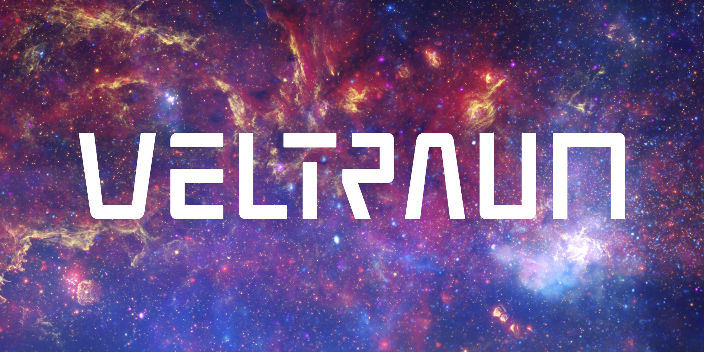

# Weltraum

Weltraum (German for "outer space") is an uppercase only space font. It has a minimalist and futuristic approach, but doesn’t sacrifice functionality or readability.

Released under the [SIL open font license](https://scripts.sil.org/OFL).

## History

* April 2021: Created the digital font
* 2018: Found that old sketchbook again
* 2005: Idea and first sketch, probably in a boring class lesson.